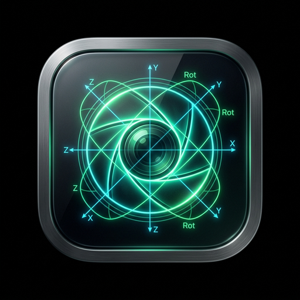
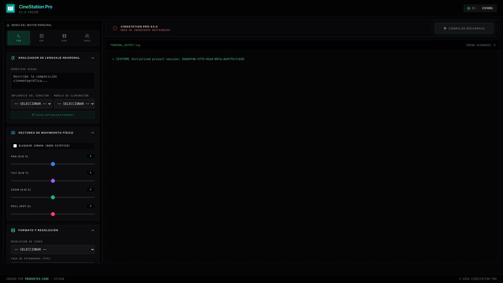

  

<h1 align="center">CineStation Pro V1.0.0</h1>

  <b>Absolute virtual cinema workstation and multi-modal generative video console</b> 
  <i>Consola de video generativo multimodal y terminal de operaciones paramétricas</i>

  
  
  
  

🌐 **Lesen Sie dies auf:** [🇬🇧 English](README.md) | [🇪🇸 Español](README_es.md) | **🇩🇪 Deutsch** | [🇷🇺 Русский](README_ru.md) | [🇯🇵 日本語](README_ja.md) | [🇺🇦 Українська](README_uk.md) | [🇨🇳 中文](README_zh.md)

---

## 🎯 Die Vision (Einführung)

Die Revolution der generativen Videos brachte ein Problem: Kontrollverlust. Schöpfer verloren die physische und optische Kontrolle über die Szene. CineStation Pro wurde entwickelt, um dem Kameramann die Kontrolle zurückzugeben. Es fungiert als parametrische Operationskonsole und hyperpräziser Übersetzer von Kamera-Physik in neuronale Payloads.

> [!NOTE]
> Developed by **produktes-code** and **Jesús Ferrer (CHUS BZN)** to establish professional standards in commercial engineering.

---

## 📸 Interface / Ergonomics

---

## ⚙️ Parameter Masterclass

- **Physische Vektor-Konsole**: Schieberegler für Bewegungen wie 'Whip Pan' erzeugen spezifische Bewegungsunschärfen, die mit generischen Prompts unmöglich sind.
- **Optik-Simulator**: Emuliert Objektive wie die 'Panavision C-Series' für organische Unvollkommenheiten wie blaue Flares und ovales Bokeh.
- **Modulare Beleuchtung**: Die Auswahl von 'Arri Skypanel' verändert das Haut-Rendering drastisch und zwingt das Modell, sich wie ein echtes Filmset zu verhalten.
- **Hybride NLP-Verarbeitung**: Transparentes Prompt-Engineering, das freien Text mit physischen Parametern strukturiert.
- **Asynchrones Backend**: Verhindert das Einfrieren der UI durch Auslagerung schwerer Renderings an Celery/Redis-Worker.

---

## 🛡️ Abschirmarchitektur

Systemabstürze sind Kapitalverlust. Shielding:

• Anti-Flood: Middlewares blockieren Spitzen.
• Magic Bytes: Hexadezimale Überprüfung der Header-Integrität.
• RAM-Sanity (2 GB Limit): Schutz vor OOM-Attacken.

---

## 🚀 Technische Bereitstellung

Zeit für Abhängigkeiten ist in der Produktion verschwendet. 'Zero-Friction'-Architektur:

• macOS: Gatekeeper wird die Binärdatei unter Quarantäne stellen (fehlendes Bezahlzertifikat). Ingenieurslösung: 'Rechtsklick -> Öffnen'. Standard bei Open Source.
• Windows: Automatische PATH-Konfiguration.

---

## 📚 Dokumentation & Handbücher

Laden Sie unser offizielles Handbuch herunter:

📥 **[USER_MANUAL.pdf (PDF - 7 Languages)](docs/USER_MANUAL.pdf)**

---

## ⚖️ Engineering Manifesto & Credits

Entwickelt von produktes-code und Jesus Ferrer (CHUS BZN). CC BY-NC-SA 4.0. CORPORATE STANDARD.

⚠️ macOS Users Notice: When opening the application for the first time, macOS may show a security warning. Solution: right-click on the application and select "Open", then click "Open" in the dialog. If it was already blocked, go to System Preferences > Privacy & Security and click "Open Anyway".