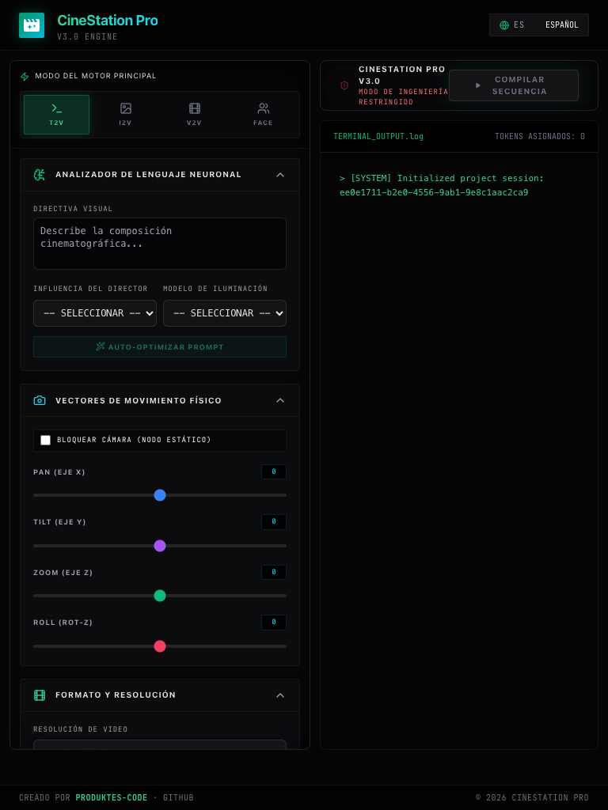
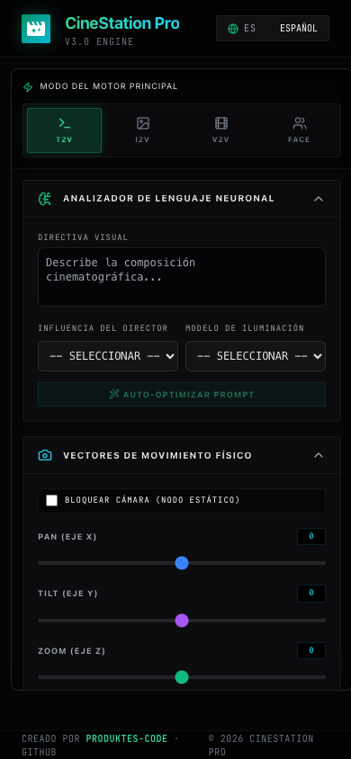

<p align="center">
  
</p>

<h1 align="center">CineStation Pro (ES)</h1>

<p align="center">
  
  
  
</p>

---

## 🎯 Descripción
**CineStation Pro** es una estación de trabajo de cine virtual y consola de vídeo generativo multimodal diseñada para directores de fotografía, artistas de VFX y creadores digitales. Traduce briefs creativos en coordenadas y vectores de movimiento físicos estructurados en 3D (`Pan`, `Tilt`, `Zoom` y `Roll`) para motores generativos de vídeo.

La plataforma está completamente localizada en **7 idiomas (ES, EN, DE, UK, RU, ZH, JA)**, facilitando la colaboración de equipos internacionales.

---

## 🛠️ Características Principales
*   **HUD de Cámara Físico:** Configura vectores paramétricos de movimiento (Pan, Tilt, Zoom y Roll) en tiempo real.
*   **Flujos Multi-Motor:** Soporte completo para modos T2V, I2V, V2V y FACE.
*   **Directivas Visuales NLP:** Auto-optimización de prompts mediante procesamiento neuronal.
*   **Consola de Terminal Interactiva:** Buffer con monitorización y conteo de tokens de prompt.
*   **Seguridad Reforzada:** Filtros de seguridad en backend para entornos de producción.

---

## 📸 Diseño Adaptativo (Capturas de Pantalla)
### Vista de Escritorio (1920x1080)

### Vista de Tablet vertical (768x1024)

### Vista de Móvil (390x844)


---

## ⚙️ Instalación y Configuración

### Despliegue con Docker (Recomendado)
Puede levantar la pila completa de servicios (Frontend, Backend FastAPI, Redis) utilizando Docker Compose:
```bash
docker compose up --build
```
La aplicación estará disponible de inmediato en `http://localhost:5173`.

### Configuración Local Manual
1. **Backend FastAPI:**
   ```bash
   cd backend
   python3 -m venv venv
   source venv/bin/activate
   pip install -r requirements.txt
   uvicorn app.main:app --port 8000
   ```
2. **Frontend React/Vite:**
   ```bash
   npm install
   npm run dev
   ```

---

## 🚀 Guía de Uso Rápido
1. Configure las variables en el archivo `.env` tomando como base `.env.example`.
2. Inicie la aplicación y seleccione su idioma nativo preferido en el menú superior (admite **7 idiomas**).
3. Importe un fotograma o vídeo. El sistema valida el tamaño (máx. **2 GB**) y la firma de los archivos.
4. Establezca los parámetros de cámara, haga clic en **Compilar Secuencia** y copie el payload de salida JSON.

---

## 🖥️ Stack Tecnológico
*   **Frontend:** React 19, Vite 8, Tailwind CSS, Lucide icons.
*   **Backend:** FastAPI (Python 3.11), SlowAPI, Pydantic settings.
*   **Cola de Renderizado:** Celery + Redis.
*   **Empaquetado Escritorio:** Electron wrapper que genera instaladores nativos (** .dmg / .exe **).

---

## 🛡️ Protocolos de Seguridad y Guardarraíles
Para asegurar la fiabilidad en producción, se aplican las siguientes reglas:
*   **Rate limiting:** Enforzado en todos los endpoints (5 req/min para render, 10/min para color/audio, 30/min general).
*   **Validación de Magic Bytes:** Las subidas se validan a nivel de binarios (**Magic Bytes**) para evitar cambios de extensión maliciosos.
*   **Límite de Carga:** Control estricto a nivel de servidor que rechaza archivos superiores a **2 GB**.
*   **Políticas CORS:** Restricción de orígenes dinámicos configurables en el backend.

---

## 📖 Enlace a la Documentación
*   Manual de Usuario (PDF): **[USER_MANUAL.pdf](docs/USER_MANUAL.pdf)**
*   Referencia de la API: **[API_REFERENCE.md](API_REFERENCE.md)**
*   Guía de Color y Presets: **[COLOR_GRADING_GUIDE.md](COLOR_GRADING_GUIDE.md)**

---

## ⚖️ Licencia y Créditos
*   **Titular:** Creado por **produktes-code** y distribuido bajo los términos de la licencia Creative Commons **CC BY-NC-SA 4.0** (Attribution-NonCommercial-ShareAlike 4.0 International).
